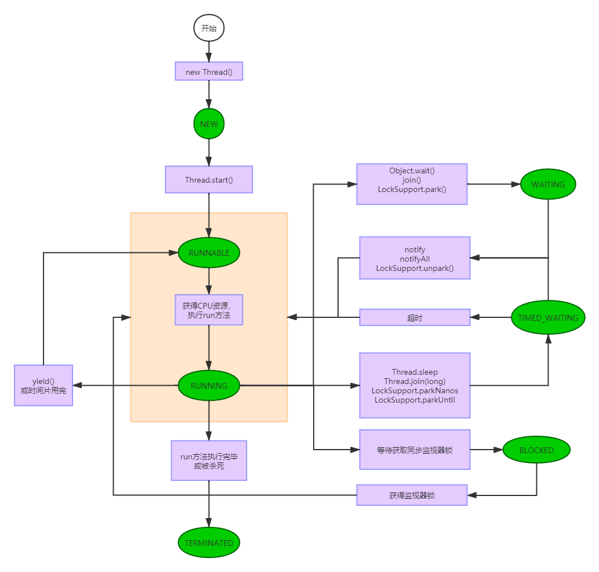

# 线程的生命周期

[啃碎并发（二）：Java线程的生命周期
](https://juejin.im/post/5a72d4bd518825735300f37b) 这篇文章写的非常好，建议看一下。

要是早点发现这篇文章的话，大雄也不用费劲在《java并发编程艺术》和《疯狂java讲义》以及各种博客找资料了。

这里我只想把这篇文章里一个图改一下贴到这里，细节部分大家可以参考上述这篇文章。

还是先说两嘴，这个生命周期的图我找到了不少版本，不仅图的形式不一样，里边的内容也有些出入

- 《疯狂java讲义》里边只有5中状态，缺少WAITING和TIMED_WAITING
- 《java并发编程艺术》里边有7中状态
- 上边的那篇文章，文字描述有7中状态，但是图里边只有6种

大雄也懵了，遂在源码找到了如下一个枚举, 里面有一些注释，翻译了一下。

```java
 public enum State {
        // 表示没有开始的线程
        NEW,

        // 表示可运行（大家的翻译应该是就绪）的线程
        // 表示在JVM正在运行，但是他可能需要等操作系统分配资源
        // 比如CPU
        RUNNABLE,

         // 表示线程在等待监视器锁
         // 表示正在等待监视器锁以便重新进进入同步块或者同步方法 
         // OR 在调用了Object.wait重新进入同步块或者同步方法
        BLOCKED,

         // 调用如下方法之一会进入WAITING
         // 1. Object.wait() 没有加超时参数
         // 2. 调用join() 没有加超时参数
         // 3. 调用LockSupport.park()
         // WAITING状态的线程在等待别的线程做一个特殊的事情（action）例如
         // 1. 调用了wait的在等待其他线程调用notify或者notifyAll
         // 2. 调用了join的在等待指定线程结束
        WAITING,

         // 就是有一个特定等待时间的线程
         // 加上一个特定的正的超时时间调用如下方法会进入此状态
         // 1. Thread.sleep
         // 2. Thread.join(long)
         // 3. LockSupport.parkNanos
         // 4. LockSupport.parkUntil
        TIMED_WAITING,

        // 执行完了结束的状态
        TERMINATED;
    }
```

对于一个拥有8级英语水品的6级没过的人来说，这段翻译太难了，但是翻译出来感觉很清晰了。

应该是 **7种状态！！！**

大雄不去具体研究状态的流转了，直接参考一些资料及上述翻译，搞一个前无古人、后有来者的线程生命周期图



这个图八成、没准、大概是没有太大问题的。此图中，原谅色是线程状态，紫色是引起状态变化的原因。