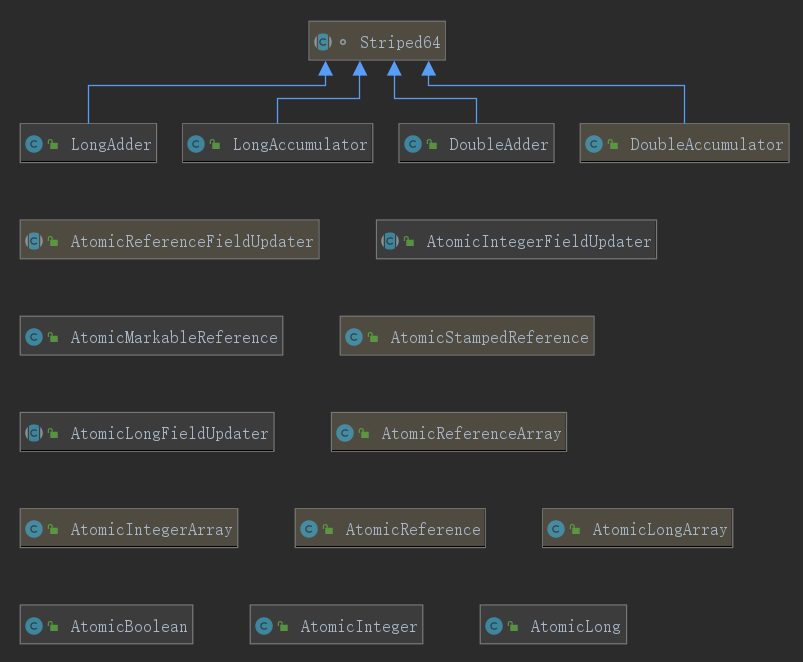

# 原子类

一个简单的i++操作, 多线程环境下如果i是共享的，这个操作就不是原子的。

为此，java.util.concurrent.atomic这个包下边提供了一些原子类，这些原子操作类提供了一种用法简单、性能高效、线程安全地更新一个变量的方式。



## 一个使用的例子

```java
public class Demo_04_01_1_Atomic {
    static class Counter {
        private AtomicInteger atomicInteger = new AtomicInteger(0);
        public int increment() {
            return atomicInteger.getAndIncrement();
        }
        public int get() {
            return atomicInteger.get();
        }
    }
    static class Counter2 {
        private int value = 0;
        public int increment() {
            return value++;
        }
        public int get() {
            return value;
        }
    }

    public static void main(String[] args) throws InterruptedException {
        // 这个用了原子类
        Counter counter = new Counter();
        // 这个没有用原子类
        Counter2 counter2 = new Counter2();
        for (int i = 0; i < 50; i++) {
            new Thread(() -> {
                for (int j = 0; j < 100; j++) {
                    counter.increment();
                    counter2.increment();
                }
            }).start();
        }
        Thread.sleep(2000);
        System.out.println(counter.get());  // 一定是5000
        System.out.println(counter2.get()); // 可能少于5000
    }
}
```
超级简单~