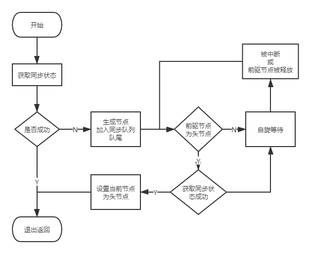

# AQS

队列同步器AbstractQueuedSynchronizer（AQS)是实现各种锁的关键，因此要了解锁的原理或者自己实现锁必须先了解AQS。

## AQS的使用

### API

#### 获取和修改AQS状态的几个方法

- protected final int getState()： 获取同步状态
- protected final void setState(int newState)：设置同步状态
- protected final boolean compareAndSetState(int expect, int update)：原子的设置同步状态

*第三个，原来的状态与expect相等，则修改为update状态，否则返回false*

#### 可以被重写的方法

- protected boolean tryAcquire(int arg): 独占式获取同步状态，在此方法中需要查询当前状态并判断是否符合预期，然后CAS设置同步状态
- protected boolean tryRelease(int arg)： 独占式释放同步状态，  等待获取同步状态的线程有机会拿到同步状态
- protected int tryAcquireShared(int arg)：共享式获取同步状态，返回>=0表示获取成功，否则表示获取失败
- protected boolean tryReleaseShared(int arg)：共享式释放同步状态
- protected boolean isHeldExclusively()：当前同步器是否在独占模式下被线程占用

#### AQS提供的模板方法

- public final void acquire(int arg)： 独占式获取同步状态，获取成功则返回，否则进入同步队列等待，会调用重写的tryAcquire(int arg)
- public final void acquireInterruptibly(int arg)：独占是获取同步状态，但是能响应中断，被中断抛异常
- public final boolean tryAcquireNanos(int arg, long nanosTimeout)：独占是获取同步状态，能响应中断，且有超时，超时返回false
- public final void acquireShared(int arg)：共享式获取同步状态，没获取到则进入同步队列，同一时刻可以有多个线程获取到同步状态
- public final void acquireSharedInterruptibly(int arg)：可以被中断
- public final boolean tryAcquireSharedNanos(int arg, long nanosTimeout)：带超时，且能被中断
- public final boolean release(int arg)：独占式释放同步状态，释放后会将同步队列第一个节点唤醒
- public final boolean releaseShared(int arg): 共享式释放同步状态；
- public final Collection<Thread> getQueuedThreads(): 获取同步队列里的线程

**一些说明：**

1. 可以把AQS理解为管理状态的一个东西，然后你可以通过重写他的一些方法定义自己的规则
2. 共享式：指几个线程可以同时获得同步状态，独占式：指只能单独的线程获得同步状态
3. 方法比较多，不要怕，通过下边的例子和之后对一些锁的实现原理分析就能理解了


### 一个使用AQS的例子

基于AQS实现一个独占不可重入锁，不可重入就是一个线程获取到了锁，然后他又来获取，这时会被阻塞

```java
public class Demo_03_02_1_AQS {
    static class DaxiongLock implements Lock {
        // AQS就是这么用的，继承他，然后根据需要重写他的方法
        // 由于我们时独占锁，所以重写独占式同步状态获取和释放，以及同步器是否被占用的判断规则
        // 我们规定，同步状态为0表示同步器没有被占用，非0表示被占用了
        private class Sync extends AbstractQueuedSynchronizer {
            @Override
            protected boolean tryAcquire(int arg) {
                // 因为0才是没被占用，所以我们期望0的时候可以获取，获取之后要改为非0
                if (compareAndSetState(0, 1)) {
                    // 设置当前线程占用了这个访问的权限
                    setExclusiveOwnerThread(Thread.currentThread());
                    return true;
                }
                return false;
            }

            @Override
            protected boolean tryRelease(int arg) {
                if (getState() == 0) {  // 没被占用尝试释放，直接抛异常，也就是必须式获取了同步状态的线程才能释放他
                    throw new IllegalMonitorStateException();
                }
                // 为什么这里不需要用原子操作？因为释放的时候说明那个线程占用同步器，而同步器只会被一个线程占用
                // 所以一定是原子的
                setState(0);
                setExclusiveOwnerThread(null);
                return true;
            }

            @Override
            protected boolean isHeldExclusively() {
                // 状态>0就表示同步器被占用了
                return getState() > 0;
            }

            Condition newCondition() {
                return new ConditionObject();
            }
        }

        private final Sync sync = new Sync();

        @Override
        public void lock() {
            // 获取失败的话会进入同步队列阻塞
            sync.acquire(1);
        }

        @Override
        public void lockInterruptibly() throws InterruptedException {
            sync.acquireInterruptibly(1);
        }

        @Override
        public boolean tryLock() {
            return sync.tryAcquire(1);
        }

        @Override
        public boolean tryLock(long time, TimeUnit unit) throws InterruptedException {
            return sync.tryAcquireNanos(1, unit.toNanos(time));
        }

        @Override
        public void unlock() {
            sync.release(1);
        }

        @Override
        public Condition newCondition() {
            return sync.newCondition();
        }
    }

    public static void main(String[] args) {
        Lock lock = new DaxiongLock();
        // 这两个线程一定是一个线程执行完了另一个执行
        new Thread(() -> {
            lock.lock();
            try {
                for (int i = 0; i < 30; i++) {
                    System.out.println(Thread.currentThread().getName() + "i=" + i);
                    Thread.sleep(1000);
                }
            } catch (InterruptedException e) {
                e.printStackTrace();
            } finally {
                lock.unlock();
            }
        }).start();
        new Thread(() -> {
            lock.lock();
            try {
                for (int i = 0; i < 30; i++) {
                    System.out.println(Thread.currentThread().getName() + "i=" + i);
                }
            } finally {
                lock.unlock();
            }
        }).start();
    }
}
```

代码比较多，关键处有注释。AQS就是这么用的，直接继承他，按你的需要去重写他的方法，定义自己的规则，什么样的情况下能获取，什么情况不能等等。

实现锁的时候直接调AQS的方法就好了

## AQS的原理

AQS依赖内部的同步队列来完成同步状态的管理，当前线程获取同步状态失败时，AQS会将当前线程以及等待状态等信息构造成为一个节点（Node）并将其加入同步队列，同时会阻塞当前线程，当同步状态释放时，会把首节点中的线程唤醒，使其再次尝试获取同步状态。

### Node

同步队列中的节点

```java
static final class Node {
    // 标识 是在共享式的模式下
    static final Node SHARED = new Node();
    // 标识 实在独占式的模式下
    static final Node EXCLUSIVE = null;

    // 标识线程取消，可能是因为超时或者被中断了，这是个终态，不会再block了
    static final int CANCELLED =  1;
    // 后边的先传给你需要unparking， 后边的线程被阻塞(通过park)了，
    // 所以,当前节点必须在他取消或者释放时unpark他后边的节点的线程
    // 为了避免竞争，acquire方法必须首先标识他需要signal
    // 然后尝试原子acquire, 如果失败就阻塞
    static final int SIGNAL    = -1;
    // 标识线程在condition等待，等待在condition队列，直到被转移到sync 队列
    static final int CONDITION = -2;
    // 标识 acquireShared需要无条件传播
    static final int PROPAGATE = -3;
    volatile int waitStatus;
    volatile Node prev;
    volatile Node next;

    // 当前节点的线程的引用
    volatile Thread thread;
    // 下一个在condition 队列（条件队列或者等待队列）等待的节点
    Node nextWaiter;
    final boolean isShared() {
        return nextWaiter == SHARED;
    }
    final Node predecessor() throws NullPointerException {
        Node p = prev;
        if (p == null)
            throw new NullPointerException();
        else
            return p;
    }

    Node() {    // Used to establish initial head or SHARED marker
    }

    Node(Thread thread, Node mode) {     // Used by addWaiter
        this.nextWaiter = mode;
        this.thread = thread;
    }

    Node(Thread thread, int waitStatus) { // Used by Condition
        this.waitStatus = waitStatus;
        this.thread = thread;
    }
}
```

这一段对节点的定义代码少，注释贼多，看了一下，惊奇的发现，《java并发编程艺术》里边的跟里边的注释差不多

首先他是双向队列的节点，所以prev,next, 然后里边节点有自己的状态，然后有共享还是独占的标识，有自己的状态。

目前还不是特别明朗，继续看

### 入队和出队的过程

#### 入队

和普通队列一样，也是考虑tail head都是null怎么处理，有元素怎么处理，无非就是引用指来指去，不同的是，他需要保证原子性

```java
private Node enq(final Node node) {
    // compareAndSetTail或者Head失败就自旋
    for (;;) {
        Node t = tail;
        if (t == null) { // Must initialize
            if (compareAndSetHead(new Node()))
                tail = head;
        } else {
            node.prev = t;
            if (compareAndSetTail(t, node)) {
                t.next = node;
                return t;
            }
        }
    }
}
private Node addWaiter(Node mode) {
    Node node = new Node(Thread.currentThread(), mode);
    // Try the fast path of enq; backup to full enq on failure
    Node pred = tail;
    // 这里应该是一个加速吧，本来直接调enq就可以了，但是enq里边有自旋
    // 这里先直接这么尝试一把，不行再enq
    // 不得不说，牛逼啊！~
    if (pred != null) {
        node.prev = pred;
        if (compareAndSetTail(pred, node)) {
            pred.next = node;
            return node;
        }
    }
    enq(node);
    return node;
}
// 这个就是传说中的CAS操作了
private final boolean compareAndSetTail(Node expect, Node update) {
    return unsafe.compareAndSwapObject(this, tailOffset, expect, update);
}
// 还有这个
private final boolean compareAndSetHead(Node update) {
    return unsafe.compareAndSwapObject(this, headOffset, null, update);
}
```
我们发现，入队其实挺简单的，特殊的就是一个CAS操作了。CAS compareAndSet 比较交换

CAS底层是`sun.misc.Unsafe`里边提供的，都是些native方法

```java
public final native boolean compareAndSwapObject(Object var1, long var2, Object var4, Object var5);

public final native boolean compareAndSwapInt(Object var1, long var2, int var4, int var5);

public final native boolean compareAndSwapLong(Object var1, long var2, long var4, long var6);
```
第一个参标识 要改那个对象， 第二个是个偏移量，第三个是你期望他是什么值才改，第四个是你想改成什么

举个例子，A线程拿到的变量值是1，想改为3，但是在你还没改的时候B线程给他改成2了，compareAndSwapInt(obj,3333, 1, 3)就是false


#### 出队

出队就head指针的改变，出队是首节点出队，而节点是获取同步状态的节点，而同步状态只有一个节点能获取到，所以出队是不用cas的

出队的很关键一点是，他需要唤醒他后边节点的线程，让他去拿同步状态

```java
private void unparkSuccessor(Node node) {
    int ws = node.waitStatus;
    // 标识没有canceled
    if (ws < 0)
        compareAndSetWaitStatus(node, ws, 0);

    Node s = node.next;
    if (s == null || s.waitStatus > 0) {
        s = null;
        // 从后往前找，找到第一个没有被取消的节点
        for (Node t = tail; t != null && t != node; t = t.prev)
            if (t.waitStatus <= 0)
                s = t;
    }
    // 完成唤醒下一个节点的线程
    if (s != null)
        LockSupport.unpark(s.thread);
}
```
这里我找了很久首节点引用在哪修改的，但是没找到，奇怪（在后边找到了，一个节点进入到同步队列后就会开始自旋获取同步状态，获取到了就会改head引用的执行，指向自己）

### 独占式同步状态的获取与释放

获取的话，前面api里变有，是 tryAcquire(int arg) acquire(int arg) 这两方法，直接AQS源代码找就可以了

*我特么才知道idea有个快捷键叫ctrl+F12*

```java
public final void acquire(int arg) {
    // 注意&&是短路的，写的真骚气
    if (!tryAcquire(arg) &&
        acquireQueued(addWaiter(Node.EXCLUSIVE), arg))
        selfInterrupt();
}
// tryAcquire是你自己要重写的，传说中的模板方法模式啊，比如我们之前那个独占锁
protected boolean tryAcquire(int arg) {
    throw new UnsupportedOperationException();
}
// 我们自己的独占锁里边的tryAcquire
protected boolean tryAcquire(int arg) {
    // 因为0才是没被占用，所以我们期望0的时候可以获取，获取之后要改为非0
    if (compareAndSetState(0, 1)) {
        // 设置当前线程占用了这个访问的权限
        setExclusiveOwnerThread(Thread.currentThread());
        return true;
    }
    return false;
}
```
addWaiter前面说了，就是进入同步对队列，看看acquireQueued

```java
    final boolean acquireQueued(final Node node, int arg) {
        boolean failed = true;
        try {
            boolean interrupted = false;
            for (;;) {
                // p是当前节点的前驱节点
                final Node p = node.predecessor();
                if (p == head && tryAcquire(arg)) {
                    // 如果当前节点变为了头节点，且拿到了同步状态
                    // 那么将当前节点设置为头
                    setHead(node);
                    p.next = null; // help GC
                    failed = false;
                    return interrupted;
                }
                if (shouldParkAfterFailedAcquire(p, node) &&
                    parkAndCheckInterrupt())
                    interrupted = true;
            }
        } finally {
            if (failed)
                cancelAcquire(node);
        }
    }
```
这里就是你加的节点一自旋获取同步状态

然后是释放同步状态

```java
public final boolean release(int arg) {
    if (tryRelease(arg)) {
        Node h = head;
        if (h != null && h.waitStatus != 0)
        // 这个就是之前讲的出队的操作，他会唤醒当前节点的下一个不是Cancel状态的节点
            unparkSuccessor(h);
        return true;
    }
    return false;
}
// tryRelease也是需要重写的
```

《java并发编程艺术》里边有个图，对这个独占式同步状态获取流程说的比较清晰



### 共享式同步状态的获取和释放

**获取**

其实和独占差不多，不同的是可以同时有几个线程获得同步状态，而满足怎样的条件可以获取同步状态时通过重写tryAcquireShared决定的。

只要tryAcquireShared返回值>=0, 就是成功获取到了同步状态了

否则的话，也是加入同步队列里自旋，判断条件时tryAcquireShared返回值>=0了， 那么同步状态就获取成功了。

**释放**

和独占式的区别就是，他的释放是需要保证原子性的，因为独占式释放的时候时天然的原子性，而共享式的可能有几个线程同时释放，所以就要通过自旋+CAS保证原子性


### 独占式超时同步状态获取

没有太大区别，就是他加入同步对队列后会算一个deadline,deatline=当前时间+你允许的超时时间，然后自旋的时候会每次都检查
当前时间是否超出了deadline, 超出了就直接返回false

### 共享式超时同步状态获取

没什么可写的了，列个标题，猜也能猜到怎么做的了

## 一个共享式获取同步状态的例子

前面的“独占不可重入锁”演示了独占式获取同步锁，这个例子演示共享式

要求：实现一把锁，至多三个（书上是两个，咱们变化下，哈哈）线程可以获得
思路：使用四个状态，0-3， 表示剩余可以获得锁的线程数，0表示没有了，不能获取了，需要阻塞

```java
public class Demo_03_02_2_TripleLock {
    static class TripleLock implements Lock {

        static private class Sync extends AbstractQueuedSynchronizer {
            public Sync() {
                super();
                setState(3);
            }

            @Override
            protected int tryAcquireShared(int arg) {
                for (; ; ) {
                    int currentState = getState();
                    int newState = currentState - arg;
                    if (newState < 0) {
                        return newState;
                    }
                    if (compareAndSetState(currentState, newState)) {
                        return newState;
                    }
                }
            }

            @Override
            protected boolean tryReleaseShared(int arg) {
                // 注意这里也需要保证原子性，因为可能几个线程同时释放锁
                for (; ; ) {
                    int currentState = getState();
                    if (currentState >= 3) {
                        throw new IllegalStateException();
                    }
                    int newState = currentState + arg;
                    if (compareAndSetState(currentState, newState)) {
                        return true;
                    }
                }
            }

            @Override
            protected boolean isHeldExclusively() {
                return getState() <= 0;
            }
        }

        private static final Sync sync = new Sync();

        @Override
        public void lock() {
            sync.acquireShared(1);
        }

        @Override
        public void lockInterruptibly() throws InterruptedException {
            sync.acquireSharedInterruptibly(1);
        }

        @Override
        public boolean tryLock() {
            return sync.tryAcquireShared(1) >= 0;
        }

        @Override
        public boolean tryLock(long time, TimeUnit unit) throws InterruptedException {
            return sync.tryAcquireSharedNanos(1, unit.toNanos(time));
        }

        @Override
        public void unlock() {
            sync.releaseShared(1);
        }

        @Override
        public Condition newCondition() {
            // 暂时不用condition,直接返回null
            return null;
        }

    }

    public static void main(String[] args) {
        TripleLock tripleLock = new TripleLock();
        // 这个测试例子，发现0-9一下都启动了，但是每一批都只有三个线程在执行，因为只有三个线程能拿到锁
        // 三个有一个执行完了，后边的才能拿到锁
        // 证明写的没问题
        for (int i = 0; i < 10; i++) {
            Thread thread = new Thread(() -> {
                tripleLock.lock();

                try {
                    for (int j = 0; j < 10; j++) {
                        try {
                            Thread.sleep(1000);
                        } catch (InterruptedException e) {
                            e.printStackTrace();
                        }
                        System.out.println(Thread.currentThread().getName() + "执行" + j);
                    }
                } finally {
                    tripleLock.unlock();
                }
            });
            thread.setName("线程" + i);
            thread.start();
            System.out.println("线程" + i + "启动了");
        }
    }
}
```

## 小结

AQS写太多了，贴了不少代码，但是回头看，几句话就能概括AQS。

- AQS是同步状态管理的工具
- 可以通过重写他的一些方法制定自己的规则
- 获取同步状态失败时会构建一个节点放到同步队列，然后自旋获取同步状态， 当同步队列的首节点释放时就通知他的后继节点尝试获取同步状态，获取成功就把自己这只为首节点
- 共享和独占获取同步状态的区别其实是看你自己定义的规则是否允许几个线程同时获得同步状态
- 超时获取，就是会根据你给的超时时间算一个deadline,每次自旋都检查是否超出了deadline，超出了直接获取失败，返回false
