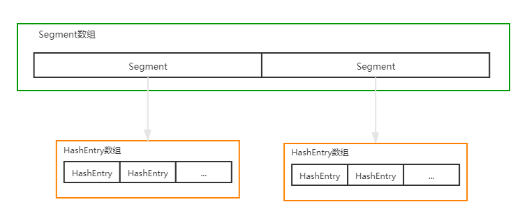

# ConcurrentHashMap

ConcurrentHashMap是线程安全且高效的HashMap

## 为什么使用

### HashMap线程不安全。

在多线程环境下，使用HashMap进行put操作会引起死循环，导致CPU利用率接近100%，所以在并发情况下不能使用HashMap

### HashTable效率低下

HashTable是util包下边的,去源码搜一个get，一个put，发现他的线程安全使用synchronized实现的，这种就是有一个线程在put时，大家都要等，有一个线程在get时也是这样。因此效率低。

```java
public synchronized V put(K key, V value)
public synchronized V get(Object key)
```

### ConcurrentHashMap效率高

使用分段锁技术提高并发访问效率。

首先将数据分成一段一段地存储，然后给每一段数据配一把锁，当一个线程占用锁访问其中一个段数据的时候，其他段的数据也能被其他线程访问。

## 原理

### 结构

- ConcurrentHashMap是由Segment数组结构和HashEntry数组结构组成
- Segment是一种可重入锁
- HashEntry用于存储键值对数据
- 一个ConcurrentHashMap里包含一个Segment数组。Segment的结构和HashMap类似，是一种数组和链表结构。
- 一个Segment里包含一个HashEntry数组
- 每个Segment守护着一个HashEntry数组里的元素
- 当对HashEntry数组的数据进行修改时，必须首先获得与它对应的Segment锁
- 这样的一个结构是我们访问时只用锁住一部分而不用锁住整个HashMap了



感觉ConcurrentHashMap了解到这里已经够了，搞清楚他高效的原因就是用了分段锁

然后就是put和get时都需要先拿到Segment,所以涉及如何定位Segment的问题，按书上说的是对key做再散列。