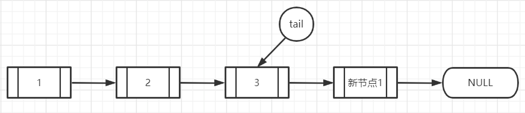

# ConcurrentLinkedQueue

基于链表的并发队列，确实像书上说的那样，要是我去做的话估计一个synchronized完事，但是jdk里边是用CAS做。

## 原理

### 入队

```java
public boolean offer(E e) {
    checkNotNull(e);
    // 构建一个节点
    final Node<E> newNode = new Node<E>(e);

    for (Node<E> t = tail, p = t;;) {
        Node<E> q = p.next; // tail的next
        if (q == null) {    // 【第一个大if】 tail.next == null
            // 其实也就是tail就是最后一个节点
            if (p.casNext(null, newNode)) { // cas设置tail.next=加进来的节点
                // 【A】
                if (p != t)
                    casTail(t, newNode);  // Failure is OK. 这个可以思考下
                //【B】
                return true;
            }
        }
        else if (p == q)    // 【第二个大if】
            // 【C】
            p = (t != (t = tail)) ? t : head;
        else    // 【大else】
            // 【D】
            p = (p != t && t != (t = tail)) ? t : q;
    }
}
```

这段代码感觉很难理解，我是画图来理解的，关键是要明白到底是两个线程怎样的运行次序才会出现代码中的if，我在代码中标注了几个位置，试图用文字来阐述我的理解

假设队列已经有三个节点了，此时没有任何线程在操作队列。

情况一：

线程1，尝试入队新节点（新节点1号），q是tail的next，肯定==nul, 所以，走到了【A】位置，暂停（假设线程1现在就卡在这里了），理一下此时的状态，p和t还有tail都是指向第三个节点的，第三个节点的next节点是指向新节点1号的


与此同时，线程2开始尝试插入节点（新节点2号），进入for，显然，此时的tail,t,p都是指向第三个节点的，注意此时的q，q是第三个节点的next节点，所以q==新节点1号，不满足【第一个大if】，而且p是指向第三个节点的，也不满足【第二个大if】，所以进入到【大else】，所以执行这个三元操作，看一个条件p!=t? p和t都是执行第三个节点的，他们相等，短路操作，后边不走了，三元条件是false，所以p指向q，暂停（假设线程2卡在这里了），梳理一下此时的状态：tail和t都是指向第三个节点，p指向q，q指向新节点1号。


线程1继续执行，p!=t?发现是相等的，都是指向第三个节点，不进入if，返回true，入队成功，此时tail是指向第三个节点，也就是倒数第二个节点，而不是最后一个节点。



线程2继续执行，再次进到for循环，q=p.next, 而前面说了p已经指向了新节点1号，新节点1号的next是null,所以q==null,进入【第一个大if】，然后cas设置p的next为新节点2号，也就是新节点1号.next=新节点2号，然后p!=t?发现p是指向新节点1号的，t还是执行3号节点的，所以if成立，cas将tail指向新节点2号，返回true。

本来想着写一个情况二、三、四把所有分支走完，但是感觉没必要了，感觉类似这样梳理就能清楚了，就是两个线程并发执行的一个重现，想不明白就可以画图，还是挺有趣的，要写出这样的代码感觉不太难，但是细节需要抠的很仔细。

*注意一下p、t、q、newNode这些不是线程共享的，只有tail还有队列里的那些东西才是共享的*

**我们会发现，一次入队后，tail并不一定是指向最后一个节点的，注释也说了，改变tail的cas失败了都是ok的，Failure is OK，所以最后一个节点并不是就是tail指的节点，得验证tail一直往下找才行**

又看了下书，说为啥不是每次入队都直接更新tail呢，是为了减少CAS操作，因为更新tail是要CAS的，CAS是耗CPU的。直接去CAS更新也是没问题的。

### 出队

不说了，直接引用书上的话。

> 并不是每次出队时都更新head节点，当head节点里有元素时，直接弹出head节点里的元素，而不会更新head节点。只有当head节点里没有元素时，出队操作才会更新head节点。这种做法也是通过hops变量来减少使用CAS更新head节点的消耗，从而提高出队效率。

**和入队差不多，出队了head指向的不一定是第一个节点**