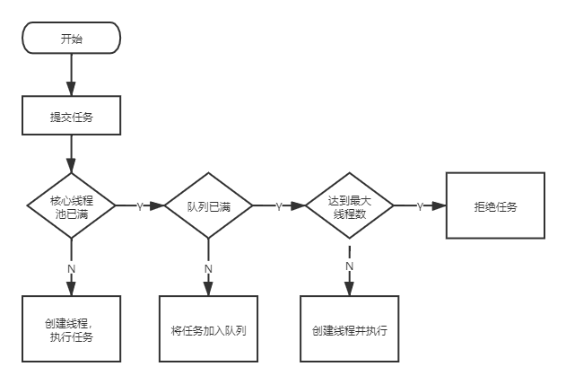

# 线程池原理

## 线程池处理流程




## 原理解析

### 互联网公司与线程池的关系

这里用一个比喻来描述一下线程池，中间有一些名词你可能不是太清楚，后边源码解析的部分会讲到。

你可以把**线程池**看作是一个**研发部门**，研发部门有很多**程序员（Worker)**, 他们在一个**大办公室里（HashSet workers)**。程序员干不完的**需求**（Runnable/Callable)放在**需求池（workQueue）**里排队。每个研发部都配置有**骨干程序员数量（corePoolSize）**和**最大能容纳的程序员数量（maximumPoolSize）**。具体要做的任务就是**产品的需求**。

new 一个线程池相当于**创建**了一个研发部，创建研发部时需要指定骨干程序员数量，最大能容纳的程序员数量，需求池用哪种（BlockingQueue）,如果忙不过来的需求怎么给产品回复（拒绝策略）等等内容。刚开始这个研发部一个程序员也没有。

当产品给这个研发部提一个需求时（当然肯定不会只提一个，他们会不断的提需求。这里以提一个需求为例）

首先会看骨干程序员招聘满了没。

如果没满，会招聘一个**骨干程序员**，招聘进来就让他不停的工作（很残酷啊），干完刚派过来的任务他会**主动在需求池找**下一个需求来做（好员工），如果需求池**没有需求**了，他就停止工作了，然后研发部会把他**裁掉**，如果裁掉后发现骨干程序员数量**不够**了，就会**再招聘**一个程序员。裁掉后，要是骨干程序员数量还够就不招聘了。

如果骨干程序员数量满了，就看需求池满没满，如果**需求池没满**，就把需求扔进需求池里；如果**需求池满了**，就看程序员数量**有没有达到上限**，如果达到了，就对产品说，这个需求我们**做不了**，没资源；如果没达到，就招聘一个程序员，招聘进来就让他不停的工作，干完刚派过来的需求他会主动到需求池找下一个任务来做，如果需求池没有任务了，他就停止工作了，然后研发部会把他裁掉，如果裁掉后发现骨干程序员数量不够了，就会再招聘一个程序员。裁掉后，要是骨干程序员数量还够就不招聘了。


### 源码解析

首先是worker（程序员）

Worker被装在一个HashSet（workers）里边， 他是用来执行任务的，他们的职责就是不断的从workQueue里边取任务，然后执行。当workQueue（需求池）里边拿不到任务，或者线程池达到特定状态，worker就会从workers里边移走（被裁）。

下边是Worker源码，移除了非关键的东西

```java
private final class Worker
    extends AbstractQueuedSynchronizer
    implements Runnable
{

    // 标识这个任务是在哪个线程运行
    final Thread thread;
    Runnable firstTask;
    // 完成了几个任务
    volatile long completedTasks;

    Worker(Runnable firstTask) {
        // 阻止中断，知道runWorker执行
        setState(-1); // inhibit interrupts until runWorker
        this.firstTask = firstTask;
        // 直接用你提供的线程工厂搞个线程出来
        this.thread = getThreadFactory().newThread(this);
    }

    // 调用ThreadPoolExecutor里边的runWorker方法
    public void run() {
        runWorker(this);
    }

    // 以下这些是AQS相关的东西

    // 0代表没有加锁
    // 1代表加锁了
    protected boolean isHeldExclusively() {
        return getState() != 0;
    }

    protected boolean tryAcquire(int unused) {
        if (compareAndSetState(0, 1)) {
            setExclusiveOwnerThread(Thread.currentThread());
            return true;
        }
        return false;
    }

    protected boolean tryRelease(int unused) {
        setExclusiveOwnerThread(null);
        setState(0);
        return true;
    }

    public void lock()        { acquire(1); }
    public boolean tryLock()  { return tryAcquire(1); }
    public void unlock()      { release(1); }
    public boolean isLocked() { return isHeldExclusively(); }

    void interruptIfStarted() {
        Thread t;
        if (getState() >= 0 && (t = thread) != null && !t.isInterrupted()) {
            try {
                t.interrupt();
            } catch (SecurityException ignore) {
            }
        }
    }
}
```

Worker实现了Runnable接口，所以他是个任务，有run方法；同时有继承了AQS，所以他也是一把锁。


下边是提交任务的过程

提交任务有submit和execute, submit就是首先将Callable或者Runnable包装成FutureTask，然后调用execute, 所以核心是分析execute

```java
public void execute(Runnable command) {
    if (command == null)
        throw new NullPointerException();
    // 这个c里边有两个信息，一个是现在有多少worker, 另一个是现在线程池的状态是啥
    // workerCountOf方法就是从里边提取 worker的数量的
    int c = ctl.get();
    if (workerCountOf(c) < corePoolSize) { // 当前worker的数量比需要的核心线程数少
        // 加worker去执行,加成功就完事了，也就是说只要worker比核心线程数少，就会创建worker
        // 不管现在核心线程是否在工作，也不管workQueue是不是满的
        // addWorker的第二个参数表示是不是要加核心线程（或者叫核心worker)
        if (addWorker(command, true))
            return;
        c = ctl.get();
    }
    // 当前worker达到或超过了核心线程数，或者加worker失败了，才会走下边的流程
    // worker已经比核心线程数多了

    // 如果 线程池没有shutdown的话 
    // 就尝试将任务加到workQueue里边，工作队列入队成功的话再往里边走
    if (isRunning(c) && workQueue.offer(command)) {
        int recheck = ctl.get();
        if (! isRunning(recheck) && remove(command))
            // 再次检查状态如果线程池要停了，那么就拒绝任务，并且把worker从工作队列扔掉
            reject(command);
        else if (workerCountOf(recheck) == 0)
            // 如果没有worker的话(说明没加进去，这种场景我没想到是什么情况)，加一个worker
            addWorker(null, false);
        // 其他情况，丢到工作队列就不用管了，等着worker去处理
    }
    // 如果队列满了加失败了，或者线程池状态不满足了，就尝试加普通worker(非核心线程)
    else if (!addWorker(command, false))
        // 加失败了就拒绝任务
        // 失败一方面可能是worker数量已经达到你的给的maximumPoolSize
        // 另一方面，可能是检查到线程池的状态不对了
        reject(command);
}
```
可以发现execute方法就是完成了上边说的“线程池处理流程”这个图里描述的过程。 大雄看到这里还有几个疑问，一个是Woker是如何创建并加入workers的，一个是worker是如何启动的，再就是worker是如何运行的

生活还要继续

```java
private boolean addWorker(Runnable firstTask, boolean core) {
    retry:
    for (;;) {
        int c = ctl.get();
        int rs = runStateOf(c);

        // 做一些校验，线程池的状态要满足一定条件
        // 而且得提交任务过来，再就是workQueue不能是空的
        if (rs >= SHUTDOWN &&
            ! (rs == SHUTDOWN &&
                firstTask == null &&
                ! workQueue.isEmpty()))
            return false;

        for (;;) {
            int wc = workerCountOf(c);
            // 看你是要创建核心worker还是普通worker
            // 核心看超没超过corePoolSize, 普通看超没超过maximumPoolSize
            if (wc >= CAPACITY ||
                wc >= (core ? corePoolSize : maximumPoolSize))
                return false;
            if (compareAndIncrementWorkerCount(c))
            // 增加worker数量失败就在来
                break retry;
            c = ctl.get();  // Re-read ctl
            if (runStateOf(c) != rs)
                // 中途线程池状态发生变化了
                continue retry;
        }
    }

    boolean workerStarted = false;
    boolean workerAdded = false;
    Worker w = null;
    try {
        // worker就是这么创建的
        w = new Worker(firstTask);
        final Thread t = w.thread;
        if (t != null) {
            final ReentrantLock mainLock = this.mainLock;
            // 加worker是要加全局锁的
            mainLock.lock();
            try {
                int rs = runStateOf(ctl.get());

                if (rs < SHUTDOWN ||
                    (rs == SHUTDOWN && firstTask == null)) {
                    if (t.isAlive()) // precheck that t is startable
                        throw new IllegalThreadStateException();
                    workers.add(w);
                    int s = workers.size();
                    if (s > largestPoolSize)
                        largestPoolSize = s;
                    workerAdded = true;
                }
            } finally {
                mainLock.unlock();
            }
            if (workerAdded) {
                // worker是在这里启动的
                t.start();
                workerStarted = true;
            }
        }
    } finally {
        if (! workerStarted)
            addWorkerFailed(w);
    }
    return workerStarted;
}
```
这段代码解决了 Woker是如何创建并加入workers的以及worker是如何启动的的问题。

addWorker做的核心工作就是，创建worker, 启动worker, 在创建之前还会做一些校验。调用了worker里边线程的start后就要等待cpu调度执行worker的run方法了。

```java
public void run() {
    runWorker(this);
}

final void runWorker(Worker w) {
    Thread wt = Thread.currentThread();
    Runnable task = w.firstTask;
    w.firstTask = null;
    w.unlock(); // allow interrupts
    boolean completedAbruptly = true;
    try {
        // task是创建worker带进去的任务，会先执行他，然后从workQueue里边取
        // 如果没有的话跳出去
        while (task != null || (task = getTask()) != null) {
            w.lock();   // 首先加锁，如果不加锁，可能几个线程提交的任务同时进来了，会导致一些共享状态出问题

            // 做一些状态的校验
            if ((runStateAtLeast(ctl.get(), STOP) ||
                    (Thread.interrupted() &&
                    runStateAtLeast(ctl.get(), STOP))) &&
                !wt.isInterrupted())
                wt.interrupt();
            try {
                // 执行任务前调用一下beforeExecute， 默认是空的
                beforeExecute(wt, task);
                Throwable thrown = null;
                try {
                    // 这个跟我们平时理解的Runnable还不一样，可以体会下，他这个run就是一个普通的方法
                    // 他直接调run是要执行任务，线程的start只是把worker里边的那个run跑起来了
                    task.run();
                } catch (RuntimeException x) {
                    thrown = x; throw x;
                } catch (Error x) {
                    thrown = x; throw x;
                } catch (Throwable x) {
                    thrown = x; throw new Error(x);
                } finally {
                    // 执行完了调一下，里边可以拿到异常
                    afterExecute(task, thrown);
                }
            } finally {
                task = null;
                w.completedTasks++;
                w.unlock();
            }
        }
        completedAbruptly = false;
    } finally {
        // 从while跳出来表明没有任务可以执行了
        processWorkerExit(w, completedAbruptly);
    }
}
```

这个也比较容易，就是不断的从workQueue取任务，执行，直到没任务了跳出来。接下来就是worker如何被销毁的问题了

```java
private void processWorkerExit(Worker w, boolean completedAbruptly) {
    if (completedAbruptly) // If abrupt, then workerCount wasn't adjusted
        decrementWorkerCount();

    final ReentrantLock mainLock = this.mainLock;
    mainLock.lock();
    try {
        completedTaskCount += w.completedTasks;
        // 移除掉worker（裁员）
        workers.remove(w);
    } finally {
        mainLock.unlock();
    }

    tryTerminate();

    int c = ctl.get();
    if (runStateLessThan(c, STOP)) {
        if (!completedAbruptly) {
            int min = allowCoreThreadTimeOut ? 0 : corePoolSize;
            if (min == 0 && ! workQueue.isEmpty())
                min = 1;
            // 比核心线程数多的话，执行完的Worker直接移除就好
            if (workerCountOf(c) >= min)
                return; // replacement not needed
        }
        // 小于核心线程数就会再加个Worker, 让他继续等待接收任务（招人）
        addWorker(null, false);
    }
}
```

直接从workers里边移除worker, 移除后如果worker数量比核心线程数还少，就再加个worker, 否则不加。


## 一些体会

看源码一定不要过分纠结细节，就像这个线程池，我看网上很多文章去算那几个位运算的十进制数，感觉是在浪费时间，没有抓住重点。

当然这也不是绝对的（似乎说的矛盾了），一些细节的设计还是非常精妙值得学习的。还是这个位运算，为什么只用一个int表示线程池状态和worker的数量呢。

要多多联想，还是这个位运算，他是不是和读写锁用一个int既表示写状态又表示读状态十分相似。Worker继承AQS，是否能让你想起AQS的种种。

总之，个人觉得第一遍看是一定不能沉溺于细节的，他会让你迷惘和丧失信心；第二遍、第三遍可以关注一下细节，感受大师级的设计的美妙之处。当然笔者仅仅粗略看了一遍（逃~）


