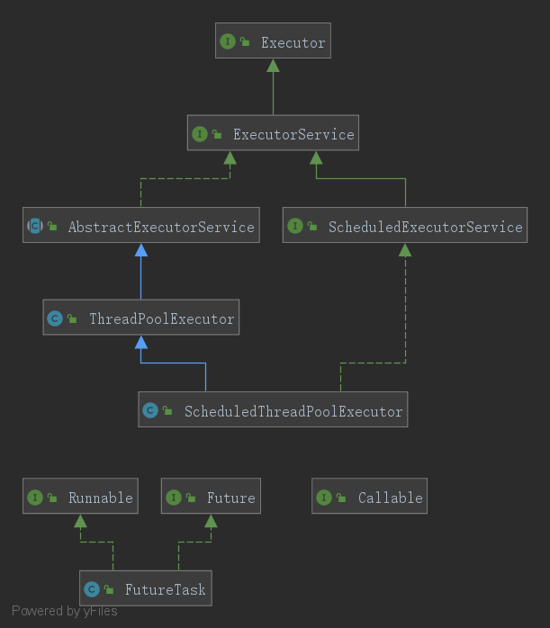

# Executor框架

前面讲的ThreadPoolExecutor其实是Executor框架中的一员。从JDK 5开始，把工作单元与执行机制分离开来。工作单元（可执行的任务）包括Runnable和Callable，而执行机制由Executor提供。

## Executor框架成员及其体系



以上就是Executor框架的一个简版UML，生成此图时发现其中还有其他成员，直接参考《java并发编程艺术》移除了。

Executor框架共有三大成员+一工具类

### Executor

他负责任务的执行, 主要包括如下两个实现类

#### ThreadPoolExecutor

使用Executors可以创建三种ThreadPoolExecutor,分别如下：

- SingleThreadExecutor：创建只有单个线程的线程池
- FixedThreadPool：用于创建固定线程数量的线程池
- CachedThreadPool：创建一个会根据需要创建新线程的线程池

#### ScheduledThreadPoolExecutor

它主要用来在给定的延迟之后运行任务，或者定期执行任务

ScheduledThreadPoolExecutor适用于需要多个后台线程执行周期任务，同时为了满足资源管理的需求而需要限制后台线程的数量的应用场景。

### 任务

包括Runnable和Callable， 一个表示没有返回结果的任务，一个表示有返回结果的任务，这个我们太熟悉了

### 任务执行结果

包括Future接口及其实现类FutureTask，这个也是我们的老朋友了

### Executors

他是一个工具类，就像Arrays和Collections, 他是一个创建各种ThreadPoolExecutor的工具

## ThreadPoolExecutor详解

ThreadPoolExecutor的创建前面已经讲过了，里边涉及到很多的参数，这里不再赘述。这里主要是探讨Excutors为我们提供了几种实用ThreadPoolExecutor

### FixedThreadPool

他的源码如下：

```java
public static ExecutorService newFixedThreadPool(int nThreads, ThreadFactory threadFactory) {
    return new ThreadPoolExecutor(nThreads, nThreads,
                                    0L, TimeUnit.MILLISECONDS,
                                    new LinkedBlockingQueue<Runnable>(),
                                    threadFactory);
}
```

他的特点是
- 核心线程数和最大线程数是相等的
- 线程保活时间是0，就是说执行完，线程会被立即销毁
- 工作队列是使用的有界队列LinkedBlockingQueue，这个队列的界在Inter.MAX_VALUE, 这意味这他通常不会因为任务数量过多拒绝任务

### SingleThreadExecutor

他的源码如下：

```java
public static ExecutorService newSingleThreadExecutor(ThreadFactory threadFactory) {
    return new FinalizableDelegatedExecutorService
        (new ThreadPoolExecutor(1, 1,
                                0L, TimeUnit.MILLISECONDS,
                                new LinkedBlockingQueue<Runnable>(),
                                threadFactory));
}
```

他的特点是：

- 核心线程数和最大线程数都是1
- 线程保活时间是0，就是说执行完，线程会被立即销毁，重新创建
- 工作队列也是使用的LinkedBlockingQueue


### CachedThreadPool

```java
public static ExecutorService newCachedThreadPool(ThreadFactory threadFactory) {
    return new ThreadPoolExecutor(0, Integer.MAX_VALUE,
                                    60L, TimeUnit.SECONDS,
                                    new SynchronousQueue<Runnable>(),
                                    threadFactory);
}
```

他的特点是：

- 没有核心线程，可以无限的创建线程
- 工作队列使用SynchronousQueue, 这是一个不存储元素的队列，  这意味着，提交一个任务必须要等这个任务被消费（可能创建新线程消费，也可能是被老线程消费），下一个任务才进去执行；线程从队列获取任务时，一定要阻塞到有任务提交进去。
- 线程的保活时间时60秒，意味着60秒没任务就会被销毁

## ScheduledThreadPoolExecutor

它主要用来在给定的延迟之后运行任务，或者定期执行任务。

### 两个示例

以一定的周期执行任务

```java
public class Demo_06_02_1_Exexutors {
    public static void main(String[] args) {
        ScheduledExecutorService scheduledExecutorService = Executors.newScheduledThreadPool(4);
        scheduledExecutorService.scheduleAtFixedRate(() -> {
            System.out.println("欢迎关注微信公众号'大雄和你一起学编程'"+new Date());
            try {
                Thread.sleep(10000);
            } catch (InterruptedException e) {
                e.printStackTrace();
            }
        }, 3, 1, TimeUnit.SECONDS);
    }
}
// 这段代码会在启动后3秒开始输出，然后每隔10秒输出一次
// 欢迎关注微信公众号'大雄和你一起学编程'Fri May 08 09:36:50 CST 2020
// 欢迎关注微信公众号'大雄和你一起学编程'Fri May 08 09:37:00 CST 2020
// 欢迎关注微信公众号'大雄和你一起学编程'Fri May 08 09:37:10 CST 2020
// 欢迎关注微信公众号'大雄和你一起学编程'Fri May 08 09:37:20 CST 2020
```

```java
public class Demo_06_02_2_Exexutors {
    public static void main(String[] args) {
        ScheduledExecutorService scheduledExecutorService = Executors.newScheduledThreadPool(4);
        scheduledExecutorService.scheduleWithFixedDelay(() -> {
            System.out.println("欢迎关注微信公众号'大雄和你一起学编程'"+new Date());
            try {
                Thread.sleep(10000);
            } catch (InterruptedException e) {
                e.printStackTrace();
            }
        }, 3, 1, TimeUnit.SECONDS);
    }
}
// 这段代码会在启动后3秒开始输出，然后每隔10+1秒输出一次
// 欢迎关注微信公众号'大雄和你一起学编程'Fri May 08 09:40:18 CST 2020
// 欢迎关注微信公众号'大雄和你一起学编程'Fri May 08 09:40:29 CST 2020
// 欢迎关注微信公众号'大雄和你一起学编程'Fri May 08 09:40:40 CST 2020
// 欢迎关注微信公众号'大雄和你一起学编程'Fri May 08 09:40:51 CST 2020
```
这两者的区别大家可以体会下

ScheduledThreadPool 有四种方式创建

```java
public static ScheduledExecutorService newScheduledThreadPool(int corePoolSize)
public static ExecutorService newSingleThreadExecutor()
// 还有两个是可以指定线程工厂
```

提交任务也有两种方式

```
```
