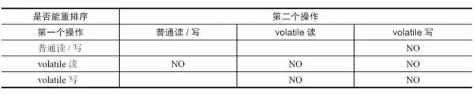

# volatile内存语义

## 特性

理解volatile特性的一个好方法是把对volatile变量的单个读/写，看成是使用同一个锁对这些单个读/写操作做了同步

对一个volatile变量的读，总是能看到（任意线程）对这个volatile变量最后的写入。

即使是64位的long型和double型变量，只要它是volatile变量，对该变量的读/写就具有原子性。如果是多个volatile操作或类似于volatile++这种复合操作，这些操作整体上不具有原子

## volatile写-读建立的happens-before关系

从内存语义的角度来说，volatile的写-读与锁的释放-获取有相同的内存效果：volatile写和锁的释放有相同的内存语义；volatile读与锁的获取有相同的内存语义。

## volatile写-读的内存语义

- 线程A写一个volatile变量，实质上是线程A向接下来将要读这个volatile变量的某个线程发出了（其对共享变量所做修改的）消息
- 线程B读一个volatile变量，实质上是线程B接收了之前某个线程发出的（在写这个volatile变量之前对共享变量所做修改的）消息
- 线程A写一个volatile变量，随后线程B读这个volatile变量，这个过程实质上是线程A通过主内存向线程B发送消息

## volatile内存语义的实现

为了实现volatile的内存语义，编译器在生成字节码时，会在指令序列中插入内存屏障来禁止特定类型的处理器重排序

## JSR-133为什么要增强volatile的内存语义

在JSR-133之前的旧Java内存模型中，虽然不允许volatile变量之间重排序，但旧的Java内存模型允许volatile变量与普通变量重排序.

在旧的内存模型中，volatile的写-读没有锁的释放-获取所具有的内存语义。为了提供一种比锁更轻量级的线程之间通信的机制，JSR-133专家组决定增强volatile的内存语义

由于volatile仅仅保证对单个volatile变量的读/写具有原子性，而锁的互斥执行的特性可以确保对整个临界区代码的执行具有原子性。在功能上，锁比volatile更强大；在可伸缩性和执行性能上，volatile更有优势